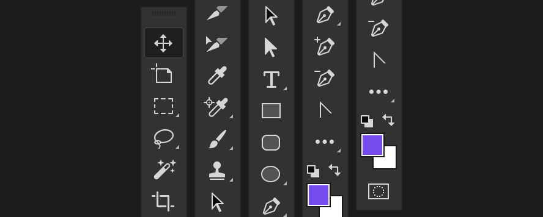

# Bjango Actions help

- [Bjango actions](https://github.com/bjango/Bjango-Actions/blob/master/Help/Actions.md)
- [Bjango scale actions](https://github.com/bjango/Bjango-Actions/blob/master/Help/Help.md#bjango-scale-actions)
- [Bjango tools panel](https://github.com/bjango/Bjango-Actions/blob/master/Help/Help.md#bjango-tools-panel)
- [Hazel rules](https://github.com/bjango/Bjango-Actions/blob/master/Help/Help.md#hazel-rules)
- [Photoshop scripts](https://github.com/bjango/Bjango-Actions/blob/master/Help/Help.md#photoshop-scripts)
- [macOS workflows](https://github.com/bjango/Bjango-Actions/blob/master/Help/Help.md#macos-workflows)
- [Feedback and future plans](https://github.com/bjango/Bjango-Actions/blob/master/Help/Help.md#feedback-and-future-plans)

-----

### Bjango actions

Too many actions to list here. Jump over to the [Bjango Actions](https://github.com/bjango/Bjango-Actions/blob/Help/Actions.md) help document to read about them all.

To install the actions, double click `Bjango Actions.atn`. The actions should then be available in the `Actions` panel in Photoshop.

-----

### Bjango scale actions

Scales the document, then runs the `Scale Patterns to 100% script`. Some scripts also run the appropriate `Mask Feather scaling` script. Astute readers will also note that these actions take a history snapshot before scaling, so even if things go horribly wrong, you should be able to recover.

To install the actions, double click `Bjango Scale Actions.atn`. The actions should then be available in the `Actions` panel in Photoshop.

-----

### Bjango tools panel

A Photoshop CC 2015 tool panel configuration, with easier access to many common screen design tools.

To install the tools panel, drag `Bjango Tools Panel.tbr` to the Photoshop app icon in your Dock. Please note that some tool keyboard shortcuts will also change (`R` for rectangle, `E` for ellipse etc). These can be edited further to suit your use.

-----

### Hazel rules

Some [Hazel](https://www.noodlesoft.com) rules to assist with moving, renaming and placing into folders, as per [My app design workflow](https://bjango.com/articles/appdesignworkflow/).

-----

### Photoshop scripts

Some amazing Photoshop scripts that will change your life for the better. `Scale Patterns to 100%` resets all patterns to 100% scale. The `Scale Mask Feather` scripts scale mask feathering by 33.3%, 50%, 66.6%, 150%, 200%, 300%, 400% or a value of your choosing. These are handy when you scale your documents.

To install the scripts, double click `Installers/Install (Photoshop CC 2015)`, or copy the scripts to your `/Adobe Photoshop CC 2015/Presets/Scripts/` folder and restart Photoshop. The scripts should then be available under the `File` → `Scripts` menu in Photoshop.

-----

### macOS workflows

A bunch of macOS workflows for adding or removing `@2x` and `@3x` from filenames. Drag files you’d like changed to the workflows to process those filenames.

-----

### Feedback and future plans

These documents are maintained by [@marcedwards](https://twitter.com/marcedwards). If you find errors or have suggestions, I’d love to hear about them.