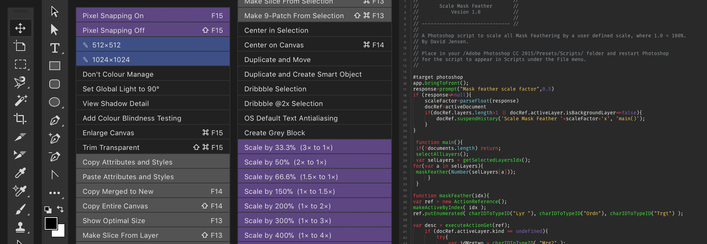

# Bjango Actions

A collection of Photoshop actions, Photoshop scripts, Hazel rules, OS X Workflows and other random things for screen designers and developers. All free and open source, released under the [BSD license](https://github.com/bjango/Bjango-Actions/blob/master/Help/License.md).

**Download:** **[Bjango Actions](https://github.com/bjango/Bjango-Actions/archive/master.zip)** — 4.0 ([version history](https://github.com/bjango/Bjango-Actions/blob/master/Help/Version%20History.md))

-----

### Help

- [Bjango Actions]()
- [Bjango Scale Actions]()
- [Bjango Tools Panel]()
- [Hazel Rules]()
- [Photoshop Scripts]()
- [OS X Workflows]()
- [Feedback and future plans]()

-----

All Photoshop Actions, Photoshop Panels and Automator Workflows created by [@marcedwards](http://twitter.com/marcedwards). All Mask Feathering scripts by David Jensen. Scale Patterns to 100% script by David Jensen, Mike Hale, Paul MR and Jacobolus. Improvements for the Dribbble selection actions suggested and prototyped by [@darkwark](http://twitter.com/darkwark). Turn Snapping On and Turn Snapping Off scripts by Marc Edwards.

More Photoshop articles and hugs can be found by visiting [bjango.com/articles/](http://bjango.com/articles/)

-----

### Legal

Apple, iPhone, iOS, tvOS, Apple TV and Apple Watch are trademarks of Apple Inc., registered in the U.S. and other countries. Microsoft and Windows are trademarks of Microsoft Corporation Inc., registered in the U.S. and other countries. Google and Android are trademarks of Google Inc., registered in the U.S. and other countries.

```
        :::::::::   :::::::     ::::      ::::    :::   ::::::::    :::::::: 
       :+:    :+:      :+:    :+: :+:    :+:+:   :+:  :+:    :+:  :+:    :+: 
      +:+    +:+      +:+   +:+   +:+   :+:+:+  +:+  +:+         +:+    +:+  
     +#++:++#+       +#+  +#++:++#++:  +#+ +:+ +#+  :#:         +#+    +:+   
    +#+    +#+      +#+  +#+     +#+  +#+  +#+#+#  +#+   +#+#  +#+    +#+    
   #+#    #+#  #+# #+#  #+#     #+#  #+#   #+#+#  #+#    #+#  #+#    #+#     
  #########    #####   ###     ###  ###    ####   ########    ########       
```
